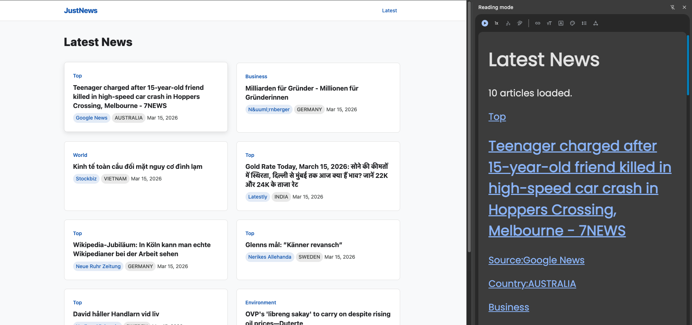
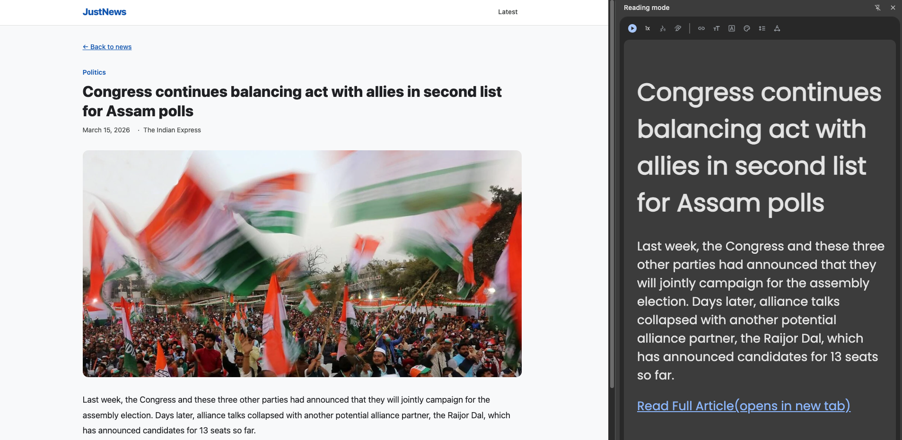
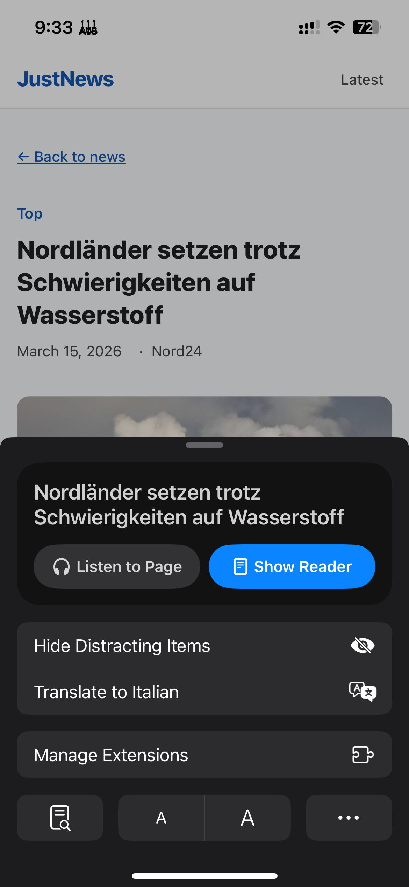
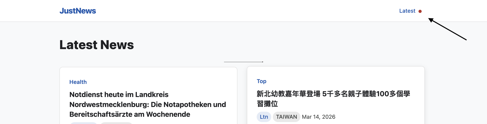
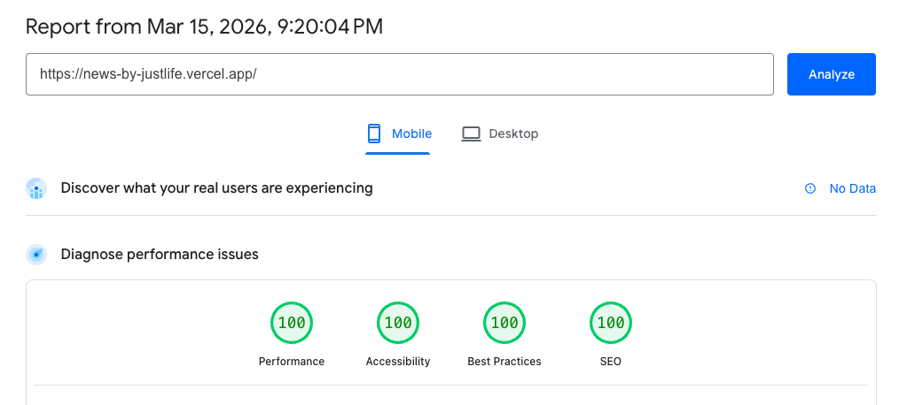
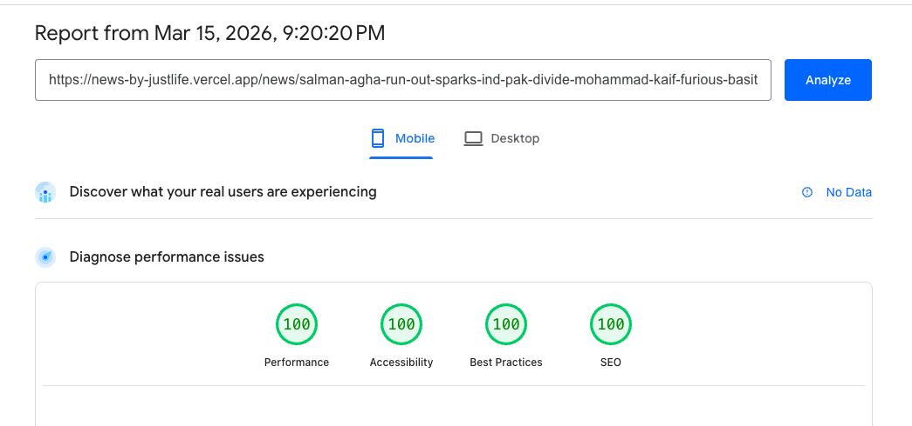
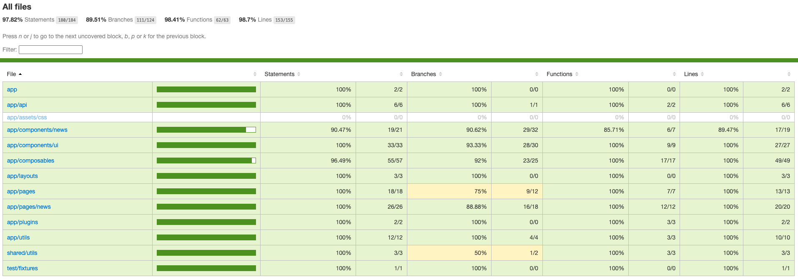

# JustNews — Documentation

**Live demo**: https://news-by-justlife.vercel.app/

## Getting Started

```bash
# 1. Clone the repository
git clone https://github.com/bippan1407/news-web-app.git
cd news-web-app

# 2. Install dependencies
yarn install

# 3. Create a .env file with your environment variables
cat <<EOF > .env
NEWS_API_KEY=your_api_key_here
NEWS_API_BASE_URL=https://newsdata.io/api/1
SITE_URL=https://news-by-justlife.vercel.app
EOF

# 4. Start the development server
yarn dev
```

The app will be available at `http://localhost:3000`.

---

## Scripts

| Command | Description |
|---|---|
| `yarn dev` | Start development server |
| `yarn dev-mobile` | Start dev server on port 80 with `--host`, accessible on local network for mobile testing |
| `yarn build` | Production build |
| `yarn preview` | Preview production build |
| `yarn test` | Run all tests (unit + nuxt) |
| `yarn test:unit` | Unit tests only |
| `yarn test:nuxt` | Nuxt integration tests only |
| `yarn test:coverage` | Run tests with coverage report |
| `yarn test:report` | Run tests with HTML reporter |

---

## Research & Analysis

After analysing several popular news websites, I identified key patterns that distinguish a well-built news platform. The following are the major areas I focused on and how I implemented each one in this project.

### Assumption

Since the content fetched from newsdata.io does not include full news article content, a "Read Full Article" button is provided on each article detail page that links to the original source.

### Pagination Implementation

The newsdata.io API uses **cursor-based pagination** — each response includes an opaque `nextPage` token rather than a numeric page count. This means you cannot jump to an arbitrary page; you can only move forward using the token from the previous response.

**Why not store page history in the URL?**

An alternative approach would be to encode all visited page tokens in the query string (e.g. `?pages=C1,C2,C3`) so that backward navigation is driven entirely by the URL. This was considered but rejected for the following reasons:

- **Token length**: newsdata.io page tokens are long opaque strings. Chaining multiple tokens in the URL would make it excessively long and could hit browser URL length limits after just a few pages.
- **Shareability**: A shared URL only needs a single token to reproduce the page. The viewer's navigation history is irrelevant — it is a session concern, not a resource identifier.

**Chosen approach**: A single `?page=<token>` query parameter identifies the current page. Previous page tokens are held in an in-memory history stack (`useState`) inside the `useCursorPagination` composable. The browser's native back/forward navigation still works because each pagination action calls `navigateTo()`, which pushes to the browser history. The in-memory stack is only used by the on-page Previous/Next controls.

---

## 1. SEO

**Finding**: Good news websites invest heavily in SEO — proper meta tags, Open Graph data for social sharing, structured data for rich search results, canonical URLs to avoid duplicate content, and dynamic sitemaps so search engines always have the latest articles indexed.

### What I implemented

- **Meta tags & Open Graph**: `title`, `description`, `og:*`, and Twitter card tags on all pages via `useSeoMeta`.
- **Canonical links**: Homepage points to itself; article pages point to the original source URL.
- **JSON-LD structured data**: `Article` schema on detail pages (author = original source, publisher = JustNews); `ItemList` schema on the homepage.
- **Dynamic sitemap**: Auto-generated via `@nuxtjs/sitemap` with dynamically fetched article URLs, `lastmod`, and image entries.
- **robots.txt**: Allows all crawlers, points to the sitemap.

---

## 2. Keyboard Navigation

**Finding**: News websites that follow accessibility best practices allow users to navigate entirely via keyboard — tabbing through articles, pressing Enter to open them, and using landmark shortcuts to jump between page sections. This benefits power users and is essential for users who cannot use a mouse.

### What I implemented

- **Article cards** are focusable and respond to the **Enter** key, opening the article in a new tab (`@keydown.enter.prevent` in `ArticleCard.vue`).
- **Global focus styles**: A `:focus-visible` rule in `main.css` applies a consistent 3px solid outline to all interactive elements, so keyboard users always see where focus is.
- **Component-level focus styles**: Pagination buttons, article cards (`:focus-within`), and the "Read more" link all have dedicated focus indicators.
- **Semantic landmarks**: The layout uses `<header>`, `<nav>`, `<main>`, and `<footer>`, allowing keyboard users with assistive technology to jump between page regions.

---

## 3. Screen Reader Support

**Finding**: Leading news sites ensure their content is fully accessible to screen readers — using ARIA attributes for dynamic content, visually hidden labels for context that sighted users get visually, and semantic HTML so the page structure is meaningful without seeing it.

### What I implemented

- **Visually hidden labels (`.sr-only`)**: Context labels like "Source:", "Country:", "(opens in new tab)", and new-content announcements.
- **ARIA attributes**: `aria-label`, `aria-disabled`, `role="alert"`, and `aria-hidden` used throughout navigation, grids, pagination, and skeleton loaders.
- **Semantic HTML**: `<article>`, `<header>`, `<figure>`, `<time>`, and `<nav>` for meaningful page structure.



*Homepage in desktop reader mode — shows article list with semantic headings, source labels, and country tags parsed correctly.*



*Article detail in desktop reader mode — headline, metadata, and body content rendered in a clean, distraction-free layout.*



*Article detail on mobile Safari — reader mode and "Listen to Page" options available, confirming semantic markup is correctly interpreted.*

---

## 4. New Content Indicator

**Finding**: News is time-sensitive. Some news websites handle this by automatically reloading the page when the user switches back to the tab. However, I chose not to take that approach — a user might be reading through the article list, switch to another tab briefly, and come back expecting to continue where they left off. An automatic reload would disrupt that flow and lose their scroll position. Instead, I implemented a subtle visual indicator that lets the user decide when to refresh, keeping them in control.

### What I implemented

- **Background polling**: A composable (`useNewsPolling.ts`) polls for new articles every 60 minutes, comparing the latest article ID against the previously known one. If they differ, it flags new content as available.
- **Visibility-aware**: Polling pauses when the browser tab is hidden and resumes when it becomes visible, avoiding unnecessary network requests.
- **Visual indicator**: A pulsing red dot appears next to the "Latest" link in the header when new content is detected.
- **Refresh on click**: Clicking the "Latest" link fetches fresh data via `refreshNuxtData()` and hides the dot.



*Header showing the pulsing red dot next to the "Latest" link, indicating new articles are available.*

---

## 5. PageSpeed Insights

Both the homepage and article detail page score **100/100** across all four Lighthouse categories — Performance, Accessibility, Best Practices, and SEO.

### Homepage



*Lighthouse report for the homepage — 100/100 in Performance, Accessibility, Best Practices, and SEO.*

[View full report](https://pagespeed.web.dev/analysis/https-news-by-justlife-vercel-app/kofx3625nm?form_factor=mobile)

### Article Detail Page



*Lighthouse report for an article detail page — 100/100 across all categories.*

[View full report](https://pagespeed.web.dev/analysis/https-news-by-justlife-vercel-app-news-salman-agha-run-out-sparks-ind-pak-divide-mohammad-kaif-furious-basit-ali-lashes-out-at-batter-8104cd70aadcbfdb829b5f79fe4f2949/m3a7srbsvz?form_factor=mobile)

---

## 6. Test Coverage

The project uses **Vitest** with two workspaces — unit tests (node environment) and Nuxt integration tests (`@nuxt/test-utils`). Overall coverage sits at **97.82% statements**, **89.51% branches**, **98.41% functions**, and **98.7% lines**.



*Vitest coverage summary — per-directory breakdown of statements, branches, functions, and lines covered.*

| Directory | Statements | Branches | Functions | Lines |
|---|---|---|---|---|
| app | 100% | 100% | 100% | 100% |
| app/api | 100% | 100% | 100% | 100% |
| app/components/news | 90.47% | 90.62% | 85.71% | 89.47% |
| app/components/ui | 100% | 93.33% | 100% | 100% |
| app/composables | 96.49% | 92% | 100% | 100% |
| app/layouts | 100% | 100% | 100% | 100% |
| app/pages | 100% | 75% | 100% | 100% |
| app/pages/news | 100% | 88.88% | 100% | 100% |
| app/plugins | 100% | 100% | 100% | 100% |
| app/utils | 100% | 100% | 100% | 100% |
| shared/utils | 100% | 50% | 100% | 100% |
